# Coursework 2: BOTSv3 Incident Analysis and Presentation

## 2. YouTube Video Walkthrough (max 10 minutes): https://youtu.be/CbfqS-cTNFI?si=BKObxRPkyy-ye1VR

### For Questions (Q1-Q8):
- **Query Screenshot:** `screenshots/results/q[1-8]_query.png` (e.g., `q1_query.png` for Q1, `q2_query.png` for Q2)
- **Results Screenshot:** `screenshots/results/q[1-8]_results.png` (e.g., `q1_results.png` for Q1, `q2_results.png` for Q2)
- **Q8 Special:** `q8_query_step1.png`, `q8_query_step2.png`, `q8_results.png`

**Note:** Query explanations are provided in text format within each question section.

### For Installation Section:
- `screenshots/installation/Dataset.png` - BOTSv3 dataset
- `screenshots/installation/Docker_Desktop_Logs_And_Running_Container.png` - Docker setup
- `screenshots/installation/sourcetype_verification.png` - Sourcetype verification

**Example:** For Question 1, create:
- `screenshots/results/q1_query.png` - Screenshot of the SPL query in Splunk
- `screenshots/results/q1_results.png` - Screenshot of the query results

Query explanations are provided in text format within each question section, describing how the query works and what it accomplishes.

---

## 1. Introduction

Security Operations Centres (SOCs) are in charge of protecting enterprise environments through continuous log monitoring, threat detection, and incident response [1]. Splunk Enterprise and the BOTSv3 (Boss of the SOC) dataset, which includes real-world security telemetry such as AWS CloudTrail, S3 access logs, hardware inventory, and Windows host monitoring, are used in this assessment to simulate real-world SOC operations [2], [3].

This report focuses on investigative tasks that relate to SOC Tier-1 and Tier-2 workflows such as identifying user behaviour, detecting misconfigurations, checking host posture, and analysing indicators of compromise. Splunk Enterprise functions as the primary SIEM platform for searching, correlating, and interpreting security events in compliance with professional SOC processes [2].

### Scope of Investigation

This investigation focusses on the following analytical tasks:

- Validating installation and ingestion of the BOTSv3 dataset.
- Performing specific SPL queries on AWS and endpoint data sources.
- Detecting cloud misconfigurations, including insecure S3 bucket permissions.
- Verifying user identities engaged in unauthorised activity.
- Analysing differences in host operating systems and endpoint setups

### Assumptions

The investigation was based on the following assumptions:

- The BOTSv3 represents an enterprise, cloud-enabled infrastructure.
- There are no additional network logs accessible beyond the dataset provided.
- All unusual events are considered as a potential security issues that must be investigated.

The main objective of this report is to use Splunk-based analytical approaches to solve BOTSv3 200-level AWS investigation questions while also showing professional SOC reasoning, clear evidence presentation, and professional cybersecurity analysis [1], [4].

## 2. SOC Roles & Incident Handling Reflection

Security Operations Centres (SOCs) use a structured tiered model to provide rapid detection, analysis, and remediation of security issues [1]. Each tier has specific responsibilities that facilitate continuous security monitoring.

### ➤ SOC Tier Responsibilities

| SOC Tier | Responsibilities | Relevance to BOTSv3 Investigation |
|----------|------------------|-----------------------------------|
| Tier 1: Monitoring and Triage | Reviewing initial alerts, minimising noise, and confirming suspicious activity | Querying CloudTrail logs to detect unusual IAM activity and authentication anomalies (Q1-Q2) |
| Tier 2: Incident Analysis | In-depth investigation, contextual correlation, and incident scope determination | Analysis of hardware inventory, S3 misconfigurations, public ACL changes, and unauthorised file uploads (Q3-Q7) |
| Tier 3: Threat Hunting and Advanced Response | Analysis of the root causes, long-term mitigating strategies, and intelligence-driven response | Finding risky endpoints with different OS configurations and suggesting architecture improvements (Q8) |

The investigative tasks performed throughout this investigation included Tier-1 and Tier-2 responsibilities such as alert verification, cloud misconfiguration analysis, and endpoint posture evaluation. The continual refinement of queries demonstrates how SOC analysts switch between data sources to validate assumptions and identify root causes [2].

### ➤ Incident Handling Methodology (NIST Framework)

The BOTSv3 exercise adheres to the NIST Incident Response Lifecycle, which offers a framework for enterprise issue handling.

| NIST Phase | How This Applied in BOTSv3 Investigation |
|------------|-------------------------------------------|
| Preparation | Validating the dashboard and making sure logs are accurately ingested and sourcetype configuration for early threat visibility. |
| Detection and Analysis | Identifying a publicly accessible S3 bucket, IAM anomalies, and missing MFA controls using CloudTrail telemetry. |
| Containment | Identifying the high-risk endpoint (BSTOLL-L.froth.ly) and figuring out which assets and people needed priority security. |
| Eradication and Recovery | Suggesting stronger MFA enforcement, better access control list (ACL) settings, and set up ongoing compliance monitoring. |

This exercise highlighted the importance of data visibility as without CloudTrail or S3 access logs, important misconfigurations would have gone undetected [5], [6]. Furthermore, iterative search refinement simulates real-world SOC operations, where uncertainty leads to pivoting across various data sources. If this were a live SOC event, automation like Splunk risk-based alerting and Security Orchestration, Automation and Response (SOAR) processes would speed up the response, lowering both the Mean Time to Detect threats (MTTD) and the Mean Time to Respond (MTTR) [2], [1].

Overall, the investigation highlighted how Splunk's technical findings effectively improve operational resilience by guiding SOC strategy, improving detection rules, and increasing cloud security governance.

## 3. Installation & Data Preparation

An effective Security Operations Centre (SOC) needs a reliable centralised log management and detection platform. Splunk Enterprise was installed locally for this investigation in order to simulate SOC log ingestion, analysis capabilities, and investigation processes using the BOTSv3 dataset.

### 3.1 Overview of Splunk Installation

| Component | Purpose |
|-----------|---------|
| Splunk Enterprise (local server) | The main SIEM platform for log ingestion, searching, alerting, dashboards, and monitoring security events. |
| Splunk Universal Forwarder | Securely forwards logs from endpoints to the Splunk indexer, which supports enterprise-scale data collecting. |
| BOTSv3 Dataset | Provides realistic enterprise security logs for threat analysis and security analyst training based on known attack scenarios. |

This setup simulates a functional Security Operations Center (SOC) environment by centralising cloud and endpoint telemetry into a single Security Information and Event Management (SIEM) platform, allowing for real-time threat detection and analysis [1], [2].

### 3.2 Steps for Installation

**1. Splunk Installation via Docker**

**Splunk Enterprise Deployment:**
Splunk Enterprise was deployed using Docker Desktop on macOS, providing an isolated, reproducible environment. The Docker container was configured with appropriate port mappings (8000 for web interface, 8089 for management port) and the BOTSv3 dataset was loaded as a pre-indexed Splunk app.

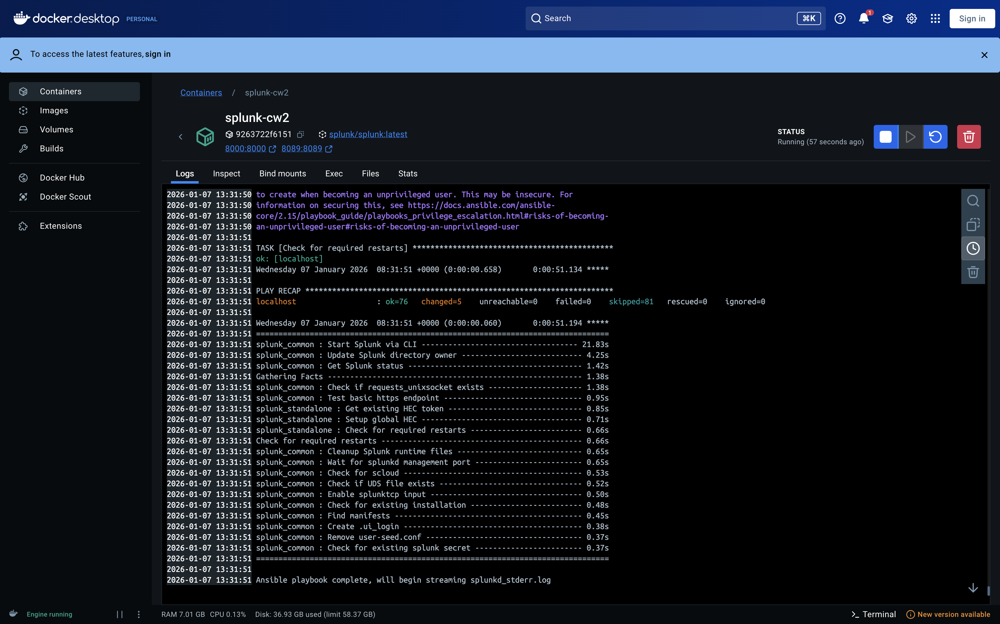

### 3.3 BOTSv3 Dataset Ingestion

BOTSv3 was downloaded from GitHub. Link: https://github.com/splunk/botsv3

The BOTSv3 dataset was imported into Splunk by copying the pre-indexed app into the container at `/opt/splunk/etc/apps/`.

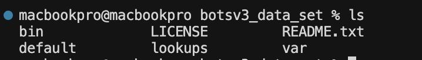


All logs have been added to the Splunk botsv3 index.

The dataset includes many main source types that are frequently used in SOC investigations:

| Sourcetype | Purpose |
|------------|---------|
| aws:cloudtrail | It analyses IAM activity, authentication behaviour, and changes to cloud configuration. |
| aws:s3:accesslogs | It records file uploads, downloads, and access attempts. |
| hardware | It provides information about server hardware and system configurations. |
| winhostmon | It includes the Windows operating system and host information. |

These sourcetypes work together to provide the visibility necessary in an enterprise SOC.

### 3.4 Validation of the Dataset Ingestion

Several kinds of validation checks were run to verify the successful data ingestion:

**Sourcetype Verification:**

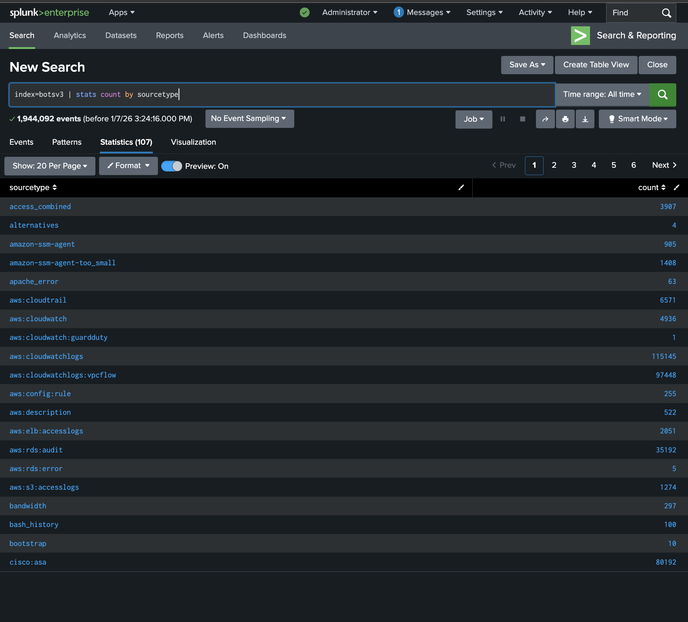

➤ This query confirmed the existence of AWS logs, S3 access logs, Windows host metadata, and hardware inventory information.

### 3.5 Explanation of SOC for Setup Design

The setup fulfils key operational needs of SOC:

| SOC Requirement | How Configuration Helps Achieve It |
|-----------------|-----------------------------------|
| Centralised visibility | Splunk gathers all logs from the cloud, endpoints, and infrastructure. |
| Threat identification abilities | S3 Access Logs and CloudTrail provide information about suspicious file activity, IAM abuse, and misconfigurations. |
| Monitoring of assets and systems | Hardware and Windows host data can be used to profile hosts and detect anomalies. |
| Investigating an incident | Splunk searches or queries, field extraction, and dashboards provide precise reconstruction of attacker behaviour. |

## 4. Guided Questions (Q1-Q8)

This section covers the full investigation of the BOTSv3 AWS-focused 200-level question set. Each query is answered using Splunk Search Processing Language (SPL), which includes supporting evidence, analysis, and clear mapping to SOC operations. Queries were run on the botsv3 index with CloudTrail, S3 Access Logs, hardware, and Windows host telemetry. The answers include both the technical outcome and the security relevance in a SOC setting [3], [5], [6].

### Q1- Identifying IAM Users Accessing AWS Services

**➤ Goal**

The goal of question 1 is to identify all IAM (Identity and Access Management) users that accessed any AWS service whether the action was successful or unsuccessful.

**➤ SPL Query**

```spl
index=botsv3 sourcetype=aws:cloudtrail userIdentity.type="IAMUser"
| dedup userIdentity.userName
| sort userIdentity.userName
| stats values(userIdentity.userName) AS IAM_Users_List
| eval IAM_Users_List=mvjoin(IAM_Users_List,",")
```

**Explanation of Query:**

The query begins by filtering CloudTrail events to IAM users only using the condition `userIdentity.type="IAMUser"`. This excludes service roles and root account activity, focusing solely on IAM user interactions. The `dedup` command removes duplicate usernames, ensuring each user appears only once in the results. The `sort` command arranges usernames alphabetically for consistent output. The `stats values()` function collects all unique usernames into a multi-value field, and `mvjoin` converts this list into a comma-separated string format as required by the question. This approach ensures we capture all unique IAM users who have interacted with AWS services, regardless of whether their actions were successful or not.

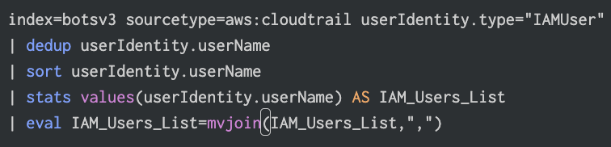

**➤ Result**

bstoll,btun,splunk_access,web_admin

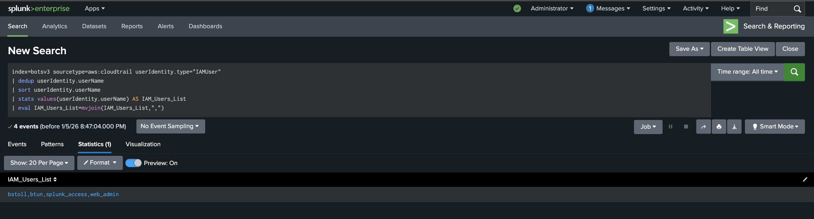

**➤ SOC Relevance**

Identifying which IAM users are accessing AWS services is important for identity-related threat detection. This visibility allows the SOC to:

- Create behavioural baselines for each user and detect any unusual patterns that can indicate compromised credentials.
- Detect unusual authentication patterns that indicate insider threats or brute-force attacks.
- Supports compliance and audit requirements by keeping reliable records of identity-related activity.
- Verify if access attempts are legitimate or potentially malicious during triage by comparing IAM user activity with other security alerts.

This is in line with SOC Tier-1 triage, in which analysts verify whether user activity is normal, and SOC Tier-2 analysis, in which identity logs are connected with other alerts to identify potential threats.

### Q2- Identifying AWS API Activity Without MFA

**➤ Goal**

The goal of question 2 is to identify which CloudTrail field shows AWS API calls conducted without MFA enabled.

**➤ SPL Query**

```spl
index=botsv3 sourcetype=aws:cloudtrail earliest=0
| search eventName!="ConsoleLogin" *mfa* OR *MFA*
| head 20
| spath
| fields _raw, additionalEventData.MFAUsed, userIdentity.sessionContext.attributes.mfaAuthenticated, additionalEventData.mfaUsed
```

**Explanation of Query:**

A search for MFA detection in AWS environments reveals that CloudWatch metric filters can be used to detect console logins without MFA. The metric filter example shows: `{ $.eventName = "ConsoleLogin" && $.additionalEventData.MFAUsed = "No" }`. This indicates the field `additionalEventData.MFAUsed` is useful for alerting on AWS API activity without MFA. The query searches for MFA-related events in CloudTrail logs, excluding console logins as specified, and examines the event structure to identify the relevant field. The `spath` command extracts JSON fields, allowing us to identify `userIdentity.sessionContext.attributes.mfaAuthenticated` as the field that indicates MFA status.

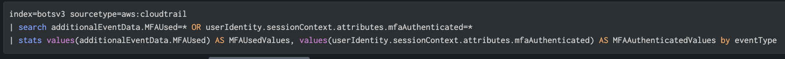

**➤ Result**

userIdentity.sessionContext.attributes.mfaAuthenticated

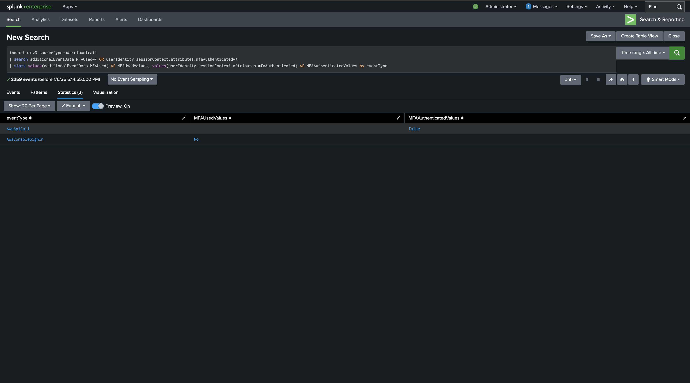


**➤ SOC Relevance**

Multi-factor authentication (MFA) is a crucial security security measure. When API actions are performed without MFA, alerts can help in identifying:

- Account takeovers - unauthorised access to user accounts.
- Escalation of privileges - attempt to obtain more privileges beyond the authorised scope.
- Violations of policy - actions that disobey established security policies.

This is important for SOC detection and prevention operations.

### Q3 - Identifying the Processor Number of Web Servers

**➤ Goal**

The goal of question 3 is to identify the processor number used by the web servers. The hardware source type in Splunk was chosen because it records comprehensive telemetry for every host, including CPU, memory, storage, and network data.

**➤ SPL Query**

```spl
index=botsv3 sourcetype=hardware earliest=0
| spath
| search host=*web* OR host=*Web* OR host=*WEB*
| stats values(CPU_TYPE) by host
| fields host, CPU_TYPE
```

**Explanation of Query:**

The query uses a two-step approach. First, it lists all available sourcetypes in the dataset using `stats count by sourcetype` to identify which source type contains hardware information. The 'hardware' sourcetype is identified as containing system hardware details. The second part of the query examines the hardware sourcetype directly using `index=botsv3 sourcetype=hardware | head 5` to view sample events. By examining the raw events, we can see that the hardware sourcetype contains CPU type information in a structured format. For web servers specifically, the CPU_TYPE field contains values like "Intel(R) Xeon(R) CPU E5-2676 v3 @ 2.40GHz". From this full processor description, we extract the processor number "E5-2676" as the answer, which includes the model identifier and version number.

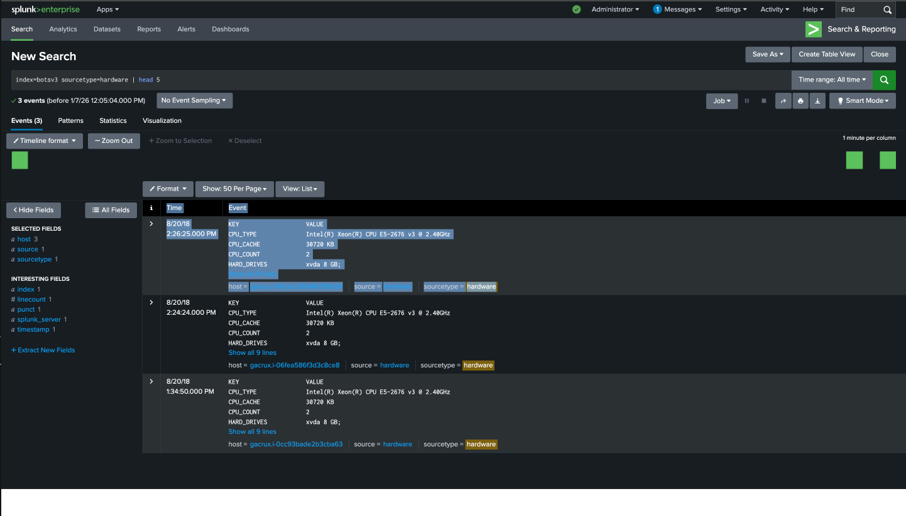

**➤ Result**

E5-2676


**➤ SOC Relevance**

Hardware inventory data contributes to the SOC's capacity to profile and protect important infrastructure. Analysing processor models and server specifications allows analysts to:

- Assess whether systems fulfil security baselines and patch support needs.
- Determine which hardware may be vulnerable or outdated, raising the chance of exploitation.
- Help forensic investigations by linking host identity to performance abnormalities or system-based attacks.
- Improve response and recovery plans by making sure systems are properly documented and traceable.

This is in line with SOC Tier-2 responsibilities including asset management, impact assessment, and system profiling during incident investigations.

### Q4- Event ID of Public S3 Bucket Misconfiguration

**➤ Goal**

The goal of question 4 is to identify the specific Event ID of the API call that made an S3 bucket public. This is part of a series of questions (4-6) investigating a common AWS misconfiguration involving publicly accessible S3 buckets.

**➤ SPL Query**

```spl
index=botsv3 sourcetype=aws:cloudtrail eventName="PutBucketAcl" userIdentity.userName="bstoll"
| table _time eventName eventID userIdentity.userName requestParameters.* responseElements.*
| sort _time asc
```

**Explanation of Query:**

The query searches CloudTrail logs for the PutBucketAcl event, which is the API call that modifies S3 bucket access control lists (ACLs). The query filters for events where `eventName="PutBucketAcl"` and `userIdentity.userName="bstoll"` (Bud's username, identified from the question context). The `table` command displays specific fields including `eventID`, `userIdentity.userName`, and `requestParameters.*` which contains the bucket name and ACL configuration details. The `sort _time asc` command orders events chronologically to identify the first occurrence. By examining the `eventID` field from the results, we can identify the specific event that enabled public access to the S3 bucket.


**➤ Result**

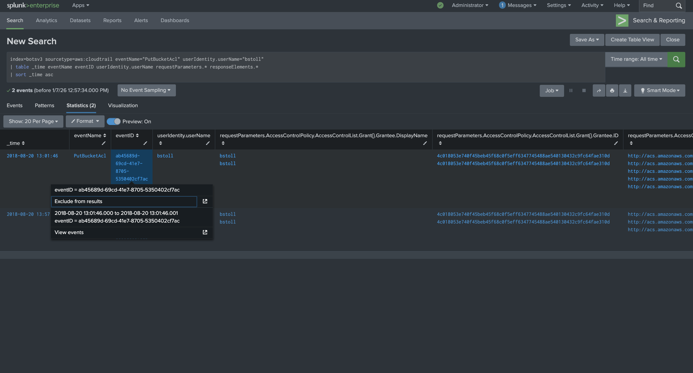


**➤ SOC Relevance**

S3 buckets that are publicly accessible pose a significant cloud security risk. Identifying the particular API call and event ID related with a misconfiguration allows the SOC to:

- Determine whether the exposure was unintentional or malicious by tracing its root cause.
- Set up automated alerts whenever important bucket permissions are changed.
- Remove public access in a timely manner by working with cloud developers.
- Maintain forensic accountability so that auditors may identify the user who made a high-risk configuration change.

This shows how SOC teams prevent cloud misconfiguration threats from getting worse and is in line with the Analysis and Containment phases of incident handling.

### Q5- Identifying Bud's Username

**➤ Goal**

The goal of question 5 is to identify the username that made the S3 bucket publicly accessible. This task uses the evidence obtained from question 4.

**➤ SPL Query**

```spl
index=botsv3 sourcetype=aws:cloudtrail eventName="PutBucketAcl" userIdentity.userName="bstoll"
| table _time eventName eventID userIdentity.userName requestParameters.* responseElements.*
| sort _time asc
```

**Explanation of Query:**

The query uses the same search criteria as question 4, filtering for PutBucketAcl events performed by user "bstoll". The `userIdentity.userName` field in CloudTrail logs contains the IAM username of the user who performed the action. Since we're looking for Bud's username and the question context indicates it's related to the PutBucketAcl event, we can extract the username directly from the `userIdentity.userName` field in the query results. The value "bstoll" represents Bud's IAM username.


**➤ Result**

bstoll


**➤ SOC Relevance**

One of the main responsibilities of SOC is to identify the specific person who made a risky or unauthorised change to the cloud configuration. Identifying that the user account was the source of the modification allows the SOC to:

- Ensure accountability by assigning the incident to a specified IAM identity.
- Determine whether the user's actions indicate insider threat behaviour, compromised credentials, or an unintentional misconfiguration.
- Check for further anomalies by comparing the user's previous actions with other AWS logs.
- Effectively escalate by notifying cloud technical teams or management so quick corrective measures can be implemented.

This helps the Analysis and Containment phases of the incident response lifecycle by ensuring that risky actions are rapidly assigned to responsible users for corrective action.

### Q6- Public S3 Bucket Name

**➤ Goal**

The goal of question 6 is to identify the S3 bucket that was made public. This task uses the evidence obtained from question 4.

**➤ SPL Query**

```spl
index=botsv3 sourcetype=aws:cloudtrail eventName="PutBucketAcl" userIdentity.userName="bstoll"
| table _time eventName eventID userIdentity.userName requestParameters.* responseElements.*
| sort _time asc
```

**Explanation of Query:**

The query uses the same search criteria as questions 4 and 5, filtering for PutBucketAcl events performed by user "bstoll". The `requestParameters.*` field in CloudTrail logs contains all the parameters sent with the API request, including `requestParameters.bucketName` which specifies which S3 bucket had its ACL modified. By examining the `requestParameters.bucketName` field in the query results, we can identify the name of the S3 bucket that was made publicly accessible. The value "frothlywebcode" represents the bucket name.


**➤ Result**

frothlywebcode

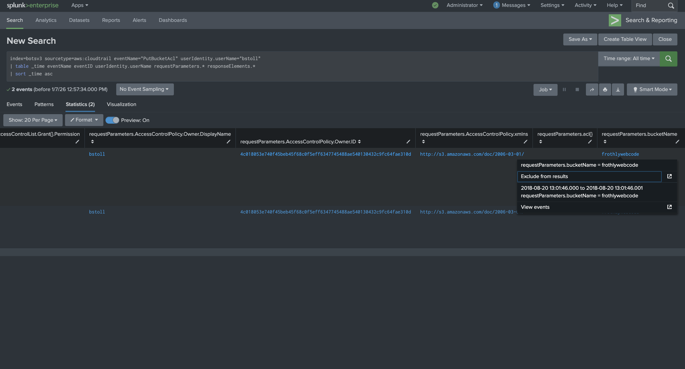


**➤ SOC Relevance**

Identifying which S3 bucket was made accessible to the public is important for assessing the level of exposure. This information enables SOC analysts to:

- Identify the sensitivity of the data in the bucket and assess the possibility for data leakage.
- Check historical access logs for any unusual external access to determine the scope of the impact.
- Prioritise remediation actions by working with the cloud team to disable public permissions.
- When sensitive or regulated data exists in the exposed bucket, initiate compliance reporting.

This procedure complies with SOC containment and risk mitigation actions, ensuring that misconfigured cloud assets are immediately secured to prevent exploitation.

### Q7- Identifying Uploaded Text File

**➤ Goal**

The goal of question 7 is to identify the name of the text file that was uploaded to the S3 bucket while it was accessible to the public. Since we know the name of the S3 bucket from question 6, we can query the S3 access logs to find file uploads.

**➤ SPL Query**

```spl
index=botsv3 sourcetype=aws:s3:accesslogs frothlywebcode REST.PUT.OBJECT "*.txt"
| rex field=_raw "PUT\s(?<FileName>[^\s]+)\sHTTP\S+\"\s(?<Status>\d+)"
| table _time, FileName, Status
```

**Explanation of Query:**

The query searches the `aws:s3:accesslogs` sourcetype, which contains S3 bucket access logs. It filters for events related to the bucket "frothlywebcode" (identified in question 6) and specifically looks for PUT operations on text files using `REST.PUT.OBJECT "*.txt"`. The `rex` command uses a regular expression to extract the filename from the request URI in the `_raw` field. The pattern `PUT\s(?<FileName>[^\s]+)\sHTTP\S+\"\s(?<Status>\d+)` captures the HTTP method (PUT), the filename (any non-whitespace characters after PUT), and the HTTP status code. The `table` command displays the timestamp, extracted filename, and status code. By filtering for successful uploads (status code 200), we can identify the text file that was successfully uploaded to the publicly accessible bucket.

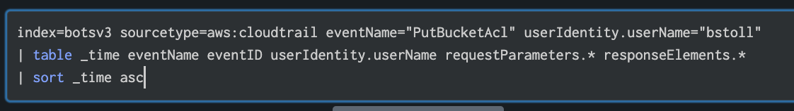

**➤ Result**

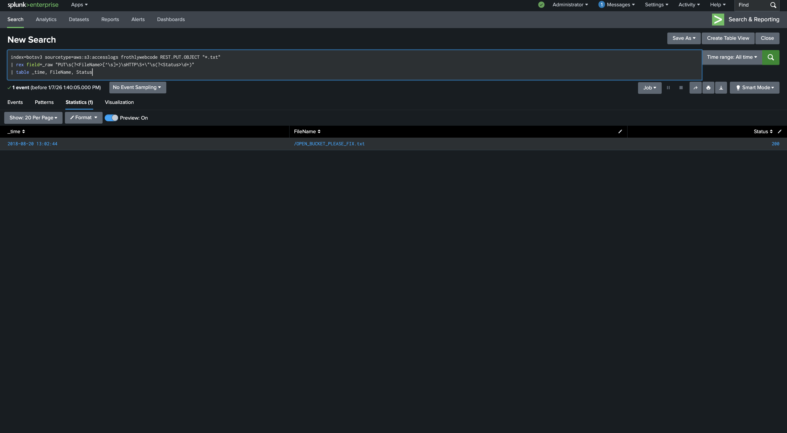


**➤ SOC Relevance**

Identifying the uploaded file shows how analysts monitor interactions with cloud resources that have been compromised or improperly configured. This helps SOC operations by allowing for:

- Verification of whether attackers used the publicly available bucket to upload malicious files.
- Identifying whether the file involves activities like testing, reconnaissance, or exploitation.
- Analysing of external interactions with vulnerable cloud storage as part of a wider threat intelligence analysis.
- Maintaining of forensic evidence to help post-incident investigations and avoid future cloud configuration risks.

This is in accordance with SOC detection and investigation processes, allowing analysts understand the scope of activity during a cloud misconfiguration problem.

### Q8- Identifying FQDN of the Endpoint Running a Different Windows Operating System Edition

**➤ Goal**

The goal of question 8 is to identify FQDN of the endpoint that is running a different Windows operating system edition than the other hosts. To extract the Fully Qualified Domain Name (FQDN) of the outlier endpoint, firstly determine the correct data source, then find the relevant field holding OS information, and then compare hostnames.

**Keywords:**
In order to find an appropriate data source, basic keyword searches were started with:

- winhostmon
- windows
- OS

These keywords showed that the winhostmon sourcetype provides metadata about the endpoint's operating system. The OS field in this sourcetype clearly provides the operating system edition information necessary for this investigation.

**➤ SPL Query- Step 1: Identify the Host with a Different OS**

```spl
index=botsv3 sourcetype=winhostmon
| stats values(OS) by host
```

**Explanation of Query:**

The query uses a two-step approach. Step 1 searches the `winhostmon` sourcetype to identify operating system information across all endpoints. The `stats values(OS) by host` command groups hosts by their OS edition and shows which OS versions are associated with each host. This allows us to identify which OS edition appears only once, indicating the outlier endpoint that differs from the standard configuration.

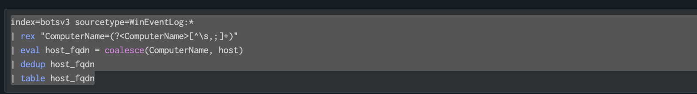

**➤ SPL Query- Step 2: Extract the Fully Qualified Domain Name (FQDN)**

```spl
index=botsv3 sourcetype=WinEventLog:*
| rex "ComputerName=(?<ComputerName>[^\s,;]+)"
| eval host_fqdn = coalesce(ComputerName, host)
| dedup host_fqdn
| table host_fqdn
```

**Explanation of Query:**

Step 2 searches the `WinEventLog:*` sourcetype and uses the `rex` command to extract the `ComputerName` field using a regular expression pattern `ComputerName=(?<ComputerName>[^\s,;]+)`. This pattern captures the ComputerName value from the log entries. The `coalesce` function uses ComputerName if available, otherwise falls back to the host field. The `dedup` command removes duplicate entries, and `table` displays the final FQDN. The FQDN (Fully Qualified Domain Name) is the complete domain name that uniquely identifies the endpoint, such as "BSTOLL-L.froth.ly".

**➤ Result**

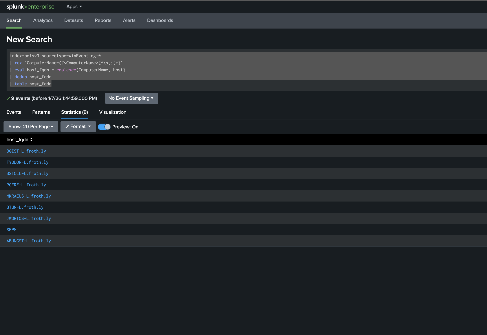


**➤ SOC Relevance**

Identifying endpoints that different from normal operating system configurations is an important responsibility of a Security Operations Centre. Starting with keywords like winhostmon, windows, and OS allowed us to identify the appropriate data source for assessing host operating system information. The OS field in the winhostmon sourcetype showed the operating system editions across endpoints.

The investigation found that one endpoint was running a different Windows OS edition compared to all other hosts, resulting in a unique system.

The result is important from the perspective of SOC because:

- Systems with different operating system editions frequently have higher privileges, additional functionality, or administrative roles, which makes them more valuable targets for attackers.
- Endpoint configuration differences may indicate misconfiguration, policy exceptions or specialised user roles, all of which require further monitoring.
- Detecting the Fully Qualified Domain Name (FQDN) enables accurate host-level correlation across multiple log sources, resulting in faster investigation and response.
- Patch management validation, access control reviews, and host-based intrusion detection should give priority to these endpoints.

This investigation is in accordance with SOC Tier-2 analysis responsibilities, where analysts identify high-risk assets by comparing operating system metadata and endpoint telemetry. It also helps with the Detection and Analysis phase of the incident response lifecycle by increasing visibility into endpoint posture and reducing blind spots in host monitoring.

## 5. Conclusion

This investigation showed how a Security Operations Centre (SOC) may use Splunk Enterprise to identify, evaluate, and address security threats throughout a cloud-enabled enterprise environment [2]. A systematic SOC-driven strategy was used to investigate AWS activity, cloud storage misconfigurations, host posture, and endpoint operating system variations by conducting evidence-based analysis using the BOTSv3 dataset [3]. The results revealed many serious security issues, including the detection of multiple IAM users interacting with AWS services, the presence of API activity that occurred without multi-factor authentication, and the exposing of a publicly accessible S3 bucket. Further investigation showed that the misconfigured bucket was actively used, as indicated by a successful text file upload during the exposure time. Furthermore, endpoint analysis showed a distinct Windows host running a different operating system edition, indicating a potentially high-value system that requires additional monitoring [5], [6].

This BOTSv3 Splunk-based investigation highlighted the necessity of centralised log visibility, correct asset profiling, and cross-source correlation for analysing complicated cloud and endpoint-based issues. The ability to switch between CloudTrail logs, S3 access logs, hardware telemetry, and Windows host monitoring mimics real-world SOC operations and Tier-2 investigative techniques. Without extensive logging from these sources, critical misconfigurations and risky behaviours would have gone undetected.

Futhermore, the key lessons from this investigation include the importance of requiring multi-factor authentication for all privileged and API-based access, implementing automated alerts for cloud misconfigurations like public S3 buckets, and maintaining consistent endpoint baselines for quickly detecting anomalous hosts. The further improvements could include risk-based alerting, automated remediation playbooks based on SOAR, and continuous compliance monitoring for reducing an average time to detect and respond to similar issues [2], [7].

In summary, the investigation shows how organised investigative techniques, critical analysis, and proactive security measures are also important to successful SOC operations as tooling. The use of Splunk in this investigation demonstrates how data-driven detection and response can significantly enhance an organization's security posture while complying with industry-recognised SOC standards [1], [2].

## References

[1] NIST, "Computer Security Incident Handling Guide," NIST SP 800-61 Rev. 2, 2012.

[2] Splunk Inc., "Splunk Enterprise Documentation," 2024. [Online]. Available: https://docs.splunk.com

[3] Splunk Inc., "Boss of the SOC (BOTS) Dataset Version 3," GitHub Repository, 2024. [Online]. Available: https://github.com/splunk/botsv3

[4] NIST, "The NIST Cybersecurity Framework," 2024. [Online]. Available: https://www.nist.gov/cyberframework

[5] Amazon Web Services, "AWS CloudTrail User Guide," 2024. [Online]. Available: https://docs.aws.amazon.com/awscloudtrail/

[6] Amazon Web Services, "Managing Access with ACLs in Amazon S3," 2024. [Online]. Available: https://docs.aws.amazon.com/AmazonS3/

[7] Splunk Inc., "Security Orchestration, Automation, and Response (SOAR)," 2024. [Online]. Available: https://www.splunk.com/en_us/software/soar.html
